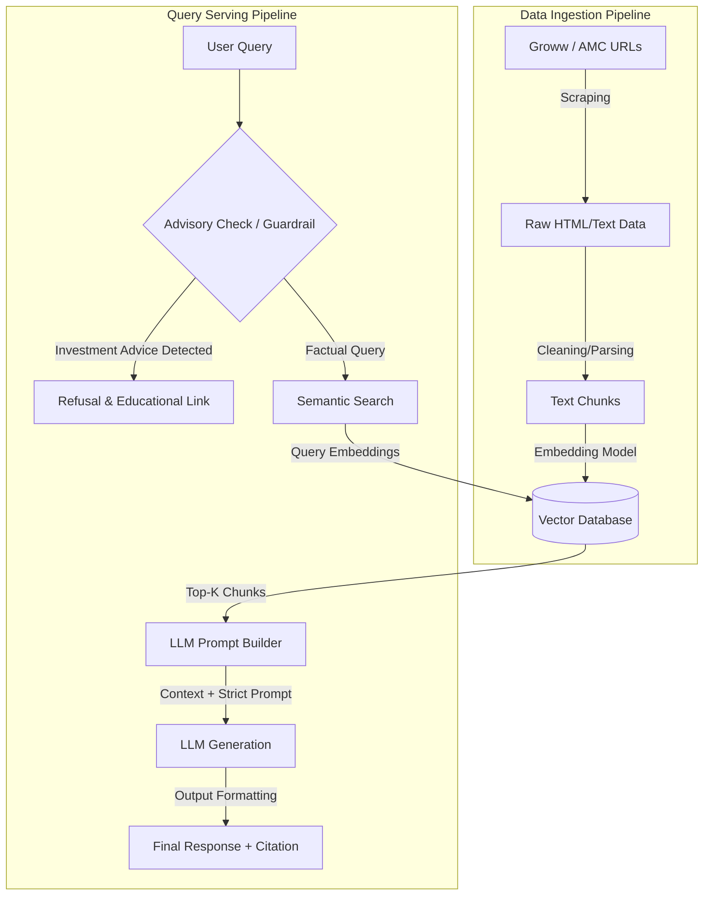

# Mutual Fund FAQ Assistant: Architecture

This document outlines the architecture for the **Facts-Only Mutual Fund FAQ Assistant**, designed to provide objective, verifiable information directly extracted from official Asset Management Company (AMC) sources.

## 1. High-Level Architecture Overview

The system is built on a **Retrieval-Augmented Generation (RAG)** pipeline. It separates the process into two distinct phases: 
1. **Offline Data Ingestion Pipeline**: Scrapes, processes, and indexes official mutual fund documentation.
2. **Online Query Serving Pipeline**: Receives user questions, retrieves factual context, and generates highly constrained, source-backed answers using an LLM.

## 2. Components Detail

### 2.1 Data Ingestion Layer
* **Source Targeting**: Targets 5 specific HDFC Mutual Fund scheme URLs on Groww (representing Factsheets, SID, and KIM equivalents).
* **Scraper**: A Python-based scraper (e.g., `BeautifulSoup`) fetches the page content, stripping out boilerplate elements like navbars, scripts, and footers to isolate the core mutual fund metrics (expense ratio, exit load, etc.).
* **Chunking Strategy**: Text is split structurally based on mutual fund sections (e.g., metrics, management, asset allocation, taxation) to preserve the context of specific numbers.
* **Embedding Model**: We utilize an open-source, lightweight embedding model (e.g., `BAAI/bge-small-en-v1.5` via `sentence-transformers`) to convert text chunks into dense vector representations.
* **Vector Store**: `ChromaDB` (or FAISS) is used to persist these embeddings locally, ensuring zero dependency on paid cloud vector databases and keeping the architecture lightweight.

### 2.2 Retrieval & Context Assembly
* When a user submits a query, it is embedded using the exact same embedding model used during ingestion.
* A similarity search retrieves the top $k$ (e.g., $k=3$) most relevant chunks from the Vector Store.
* The system attaches the source URL and extraction timestamp as metadata to the retrieved chunks to support mandatory citations.

### 2.3 LLM Generation Layer
* **LLM Engine**: We leverage **Groq** (running `Llama-3-8b`) for ultra-fast generation.
* **Prompt Engineering (Guardrails)**: The system prompt rigidly constrains the LLM:
  * *"You are a facts-only assistant."*
  * *"Do not provide investment advice or comparisons."*
  * *"If the user asks an advisory question, politely refuse and provide an AMFI link."*
  * *"Limit your response to a maximum of 3 sentences."*
  * *"Use ONLY the provided context."*

### 2.4 Presentation & Formatting Layer
* **Response Truncator**: Enforces the strict 3-sentence limitation programmatically if the LLM fails to adhere.
* **Citation Appender**: Injects exactly one citation link based on the metadata of the highest-scoring retrieved chunk.
* **Footer Appender**: Appends the mandatory footer: `“Last updated from sources: <date>”`.

### 2.5 User Interface (UI)
* A minimalist frontend (HTML/JS or Streamlit).
* Features:
  * Persistent Disclaimer: *"Facts-only. No investment advice."*
  * Chat window.
  * 3 clickable suggested example questions.

## 3. Security & Compliance
* **No PII Collection**: The system does not request, log, or persist user phone numbers, PANs, Aadhaar numbers, or account details.
* **Stateless Interaction**: Chat history is either completely ephemeral or stored strictly client-side.
* **Hallucination Prevention**: By relying purely on the vector store context and heavily instructing the LLM to ignore its prior parametric knowledge, the risk of fabricating mutual fund metrics is minimized.

## 4. Known Limitations
* **Stale Data**: Since the pipeline relies on web scraping, any structural changes to the source URLs (Groww) could break the ingestion script. The corpus must be re-ingested periodically to ensure the "Last updated" date remains current.
* **No Table Understanding**: Parsing complex asset allocation tables from raw HTML into clean context may lose column/row relationships. Advanced parsing may be required in future iterations.
