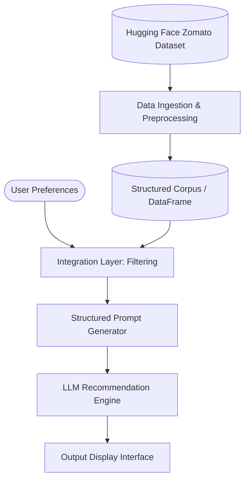

# Context: AI-Powered Restaurant Recommendation System (Zomato Use Case)

This document provides the context, objective, workflow, and core specifications for the **AI-Powered Restaurant Recommendation System**, based on the project requirements outlined in [ProblemStatement.txt](file:///c:/Git_Devashree/Nextleap_Application/Document/ProblemStatement.txt).

---

## 📌 Project Overview

The goal of this project is to build an **AI-powered restaurant recommendation service** inspired by Zomato. The system combines structured database filtering with the reasoning capabilities of a Large Language Model (LLM) to deliver personalized, human-like restaurant suggestions based on user preferences.

---

## 🎯 Core Objectives

1.  **Objective Filtering:** Filter a real-world restaurant dataset using structured user preferences (location, budget, cuisine, and rating).
2.  **LLM-Powered Personalization:** Leverage an LLM to rank the filtered options, explain *why* each restaurant fits the user's preferences, and summarize the final recommendation.
3.  **Clean User Presentation:** Display structured data (name, cuisine, rating, estimated cost) alongside natural AI explanations in an elegant interface.

---

## ⚙️ System Workflow & Architecture

### 1. Data Ingestion & Preprocessing
*   **Source Dataset:** Hugging Face Zomato Restaurant dataset ([ManikaSaini/zomato-restaurant-recommendation](https://huggingface.co/datasets/ManikaSaini/zomato-restaurant-recommendation)).
*   **Key Fields Extracted:** `Restaurant Name`, `Location`, `Cuisine`, `Estimated Cost`, `Rating`, and details.

### 2. User Input Collection
The system gathers structured user preferences:
*   **Location:** City/Area (e.g., Delhi, Bangalore).
*   **Budget:** Cost brackets (Low, Medium, High).
*   **Cuisine:** Food type (e.g., Italian, Chinese, North Indian).
*   **Minimum Rating:** Numerical boundary (e.g., 4.0+).
*   **Additional Preferences:** Descriptive tags (e.g., family-friendly, quick service, outdoor seating).

### 3. Integration & Filtering Layer
*   Performs database/dataframe filtering matching the user's location, budget, cuisine, and rating parameters.
*   Constructs a reasoning prompt for the LLM containing the structured options and user criteria.

### 4. Recommendation Engine
*   The LLM ranks the candidate restaurants.
*   Generates a personalized, human-like explanation for each recommendation.

### 5. Output Display Interface
Displays recommendations in a clean, user-friendly dashboard showing:
*   Restaurant Name
*   Cuisine Category
*   Average Rating
*   Estimated Cost
*   AI-generated reasoning summary
